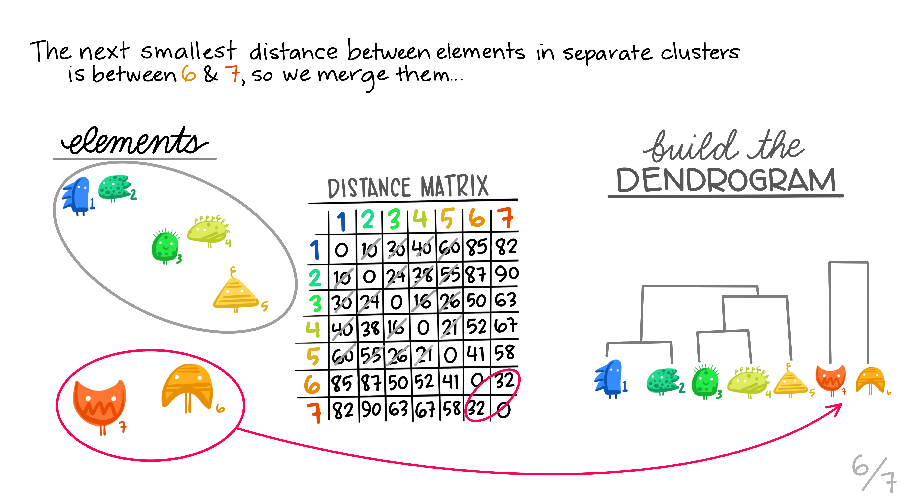

## The Course

<figure>

<figcaption>Art by @allison_horst</figcaption>
</figure>

**Computational Statistics** is an introduction to statistical methods that rely heavily on the use of computers.
The course can be broadly broken down into three sections.
The first section will include communicating and working with data in a modern era.
We will cover data wrangling, data visualization, data ethics, and collaborative research (via GitHub).
The second part of the course will focus on traditional statistical inference done through computational methods (e.g., permutation tests, bootstrapping).
The last part of the course will focus on machine learning ideas such as classification, clustering, and (possibly) dimension reduction techniques.
Some of the methods were invented before the ubiquitous use of personal computers, but only because the calculus used to solve the problem was relatively straightforward (or because the method wasn't actually ever used). 
Many of the methods have been developed within the last few years.

## Course website

The main course website is at [Computational Statistics](https://m154-comp-stats.netlify.app/).  You will find:

* syllabus
* class notes
* schedule
* assignments and due dates
* resources
* project information

## GitHub Classroom

As part of the learning goals of the class, we will be working with GitHub for all of the course assignments. Many of the assignments will be individual, but some of the homework assignments and the semester project will be done collaboratively.  The [course GitHub site]() is private; please send me your GitHub username so that you can be added to the site.

## Sakai

We will also use the Sakai course management system.  Sakai will be used for materials which are not publicly available.  This includes:

* your current grades
* solutions to assignments
* solutions to exams

