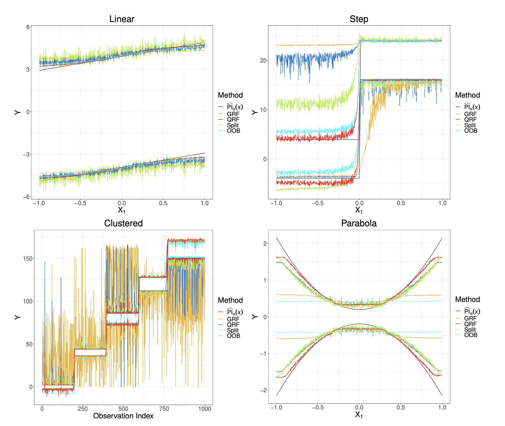

<figure>

</figure>

## my background

I have been at [Pomona College](https://www.pomona.edu/academics/departments/mathematics) since 2002 where I teach lots of different kinds of statistics, taught a little bit of math once, love teaching writing with statistics, and hope to soon teach some data science.

My undergraduate degree is also from Pomona College, in Mathematics where I worked with Don Bentley.  I did my PhD in Statistics at [UC Davis](https://statistics.ucdavis.edu/) with [David Rocke](http://dmrocke.ucdavis.edu/).  

My current [research](/research/) interests include:

<h3><i class="fas fa-chart-line"></i> &nbsp; Statistical methods for high-throughput data</h3>
<h3><i class="fas fa-sitemap"></i> &nbsp; Inference in machine learning</h3>
<h3><i class="fas fa-chalkboard-teacher"></i> &nbsp; Statistics and data science education</h3>
<h3><i class="fas fa-equals"></i> &nbsp; Equity and flourising in statistics and data science</h3> 

