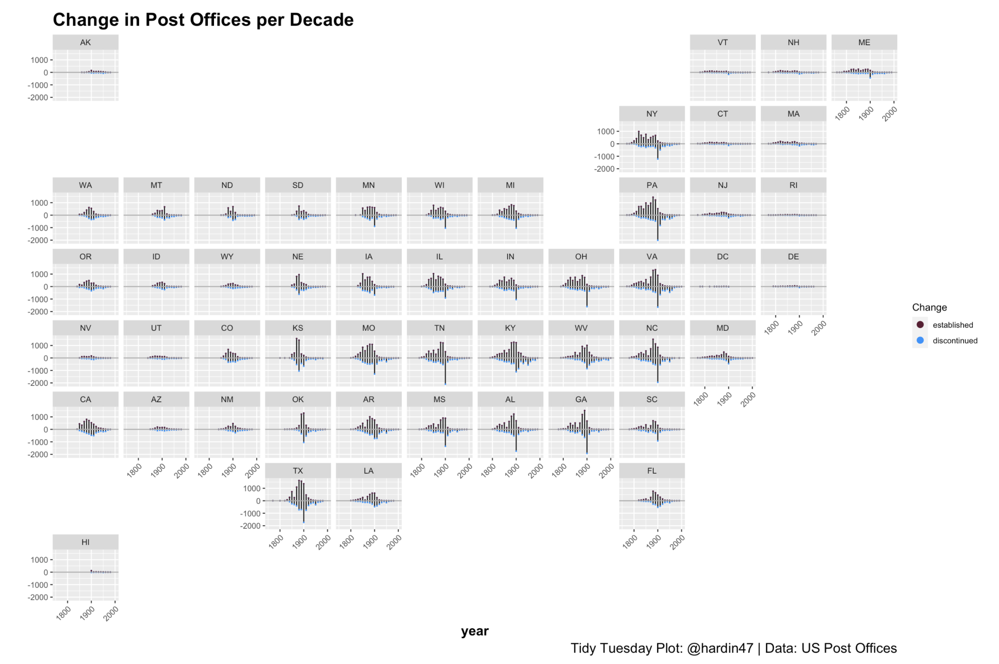

<figure>

</figure>

 

 

 

I try my best to put in a few Tuesday hours working on a TidyTuesday dataset when I can (easier to do outside the semester!).
I will be moving from Discord to in-person Hacky Hours.
Email me for time and place!
If you are in Claremont, I hope you will join us.

* Official GitHub Repo for TidyTuesday: https://github.com/rfordatascience/tidytuesday
* Each week’s data is also posted on GitHub: https://github.com/rfordatascience/tidytuesday/tree/master/data/2021
* My TidyTuesday adventures
  * GitHub repo:  https://github.com/hardin47/TidyTuesday
  * posts:  https://hardin47.github.io/TidyTuesday/
* Great idea to get started with GitHub: https://happygitwithr.com/
* Also good idea to get started with R:  https://education.rstudio.com/learn/ and https://rstudio.cloud/learn/primers
* And if you want to go through the R for Data Science book (highly recommended!): https://r4ds.had.co.nz/
* More Advanced R for data science: https://adv-r.hadley.nz/

